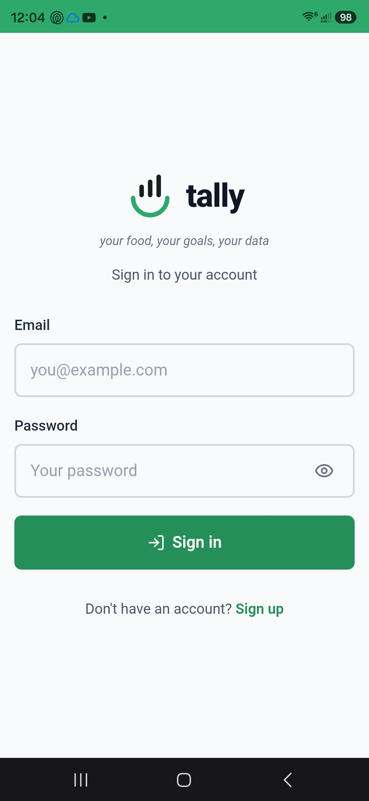
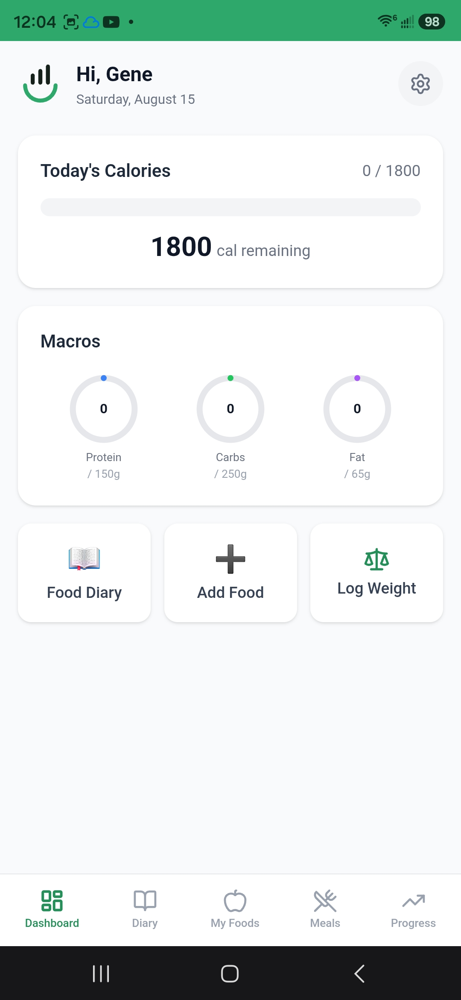
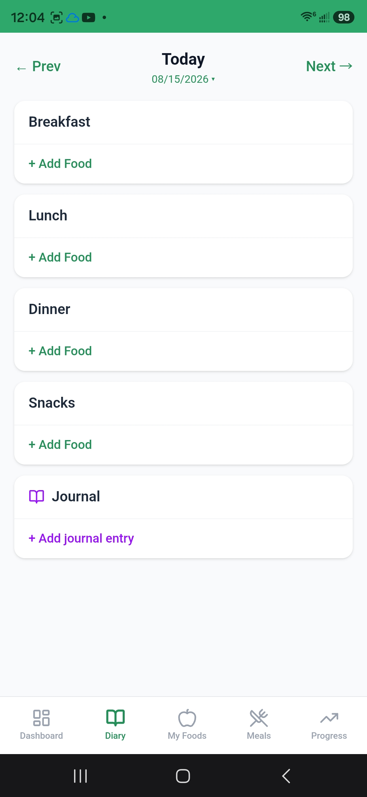
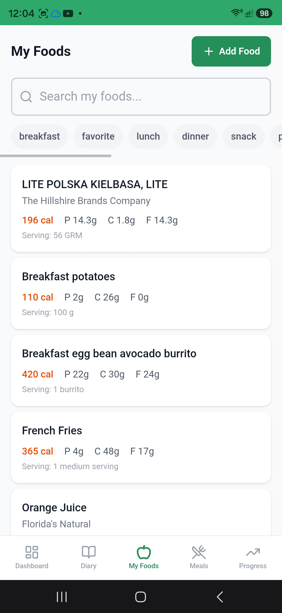
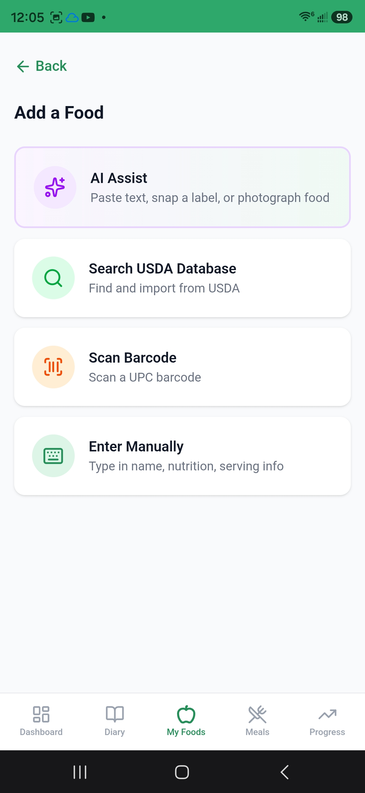
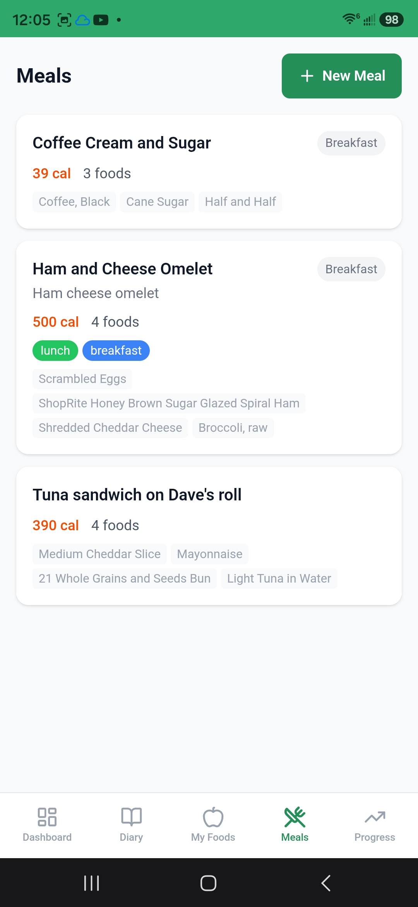

# Tally

**Your food, your goals, your data.**

A mobile-first Progressive Web App for food logging, nutrition tracking, and health goals. Self-hosted with its own SQLite database and authentication — no external backend dependencies, no subscription fees, and your data stays on your server.

## Why Tally?

- **Free** — no subscription, no ads, no premium tiers
- **Private** — your data lives on your own server, not in someone else's cloud
- **Simple** — log what you eat, track your macros, see your progress
- **AI-powered** — snap a photo or type a description and AI extracts the nutrition data
- **Self-hosted** — deploy with Docker in minutes

## Screenshots

<p align="center">
  
  
  
  
</p>
<p align="center">
  
  
</p>

## Features

- **Dashboard** — daily calorie progress bar, macro rings (protein/carbs/fat), quick actions
- **Food Diary** — date-navigated daily diary with Breakfast/Lunch/Dinner/Snacks slots
- **My Foods** — personal food catalog with search, tag filtering, full nutrition data
- **AI Food Parser** — text or photo input parsed by AI into structured nutrition data
- **Barcode Scanner** — camera-based UPC scanning via ZXing
- **Saved Meals** — meal templates for quick logging of common combinations
- **Health Journal** — timestamped journal entries tied to diary dates
- **Profile & Goals** — calorie targets, macro goals, weight tracking
- **Weight Chart** — visual weight trend over time
- **Tag System** — organize foods with colored tags and filter by them

## Quick Start

### Docker (recommended)

```bash
git clone https://github.com/genearnold/tally.git
cd tally
cp .env.example .env
# Edit .env — at minimum set JWT_SECRET (run: openssl rand -hex 32)
docker compose up -d --build
```

The app will be available at `http://localhost:8060`. Create an account and start logging.

### Local Development

```bash
git clone https://github.com/genearnold/tally.git
cd tally
npm install
cp .env.example .env.local
# Edit .env.local — set JWT_SECRET
npm run db:migrate
npm run dev
```

Dev server runs at `http://localhost:3000`.

## Stack

| Layer | Technology |
|---|---|
| Framework | Next.js 16 (App Router, Turbopack) |
| Language | TypeScript 5 |
| Styling | Tailwind CSS 4 |
| Database | SQLite via better-sqlite3 + Drizzle ORM |
| Auth | bcrypt + JWT (HttpOnly cookies) |
| Charts | Recharts 3 |
| Icons | Lucide React |
| Barcode | ZXing |
| AI | Groq (free text), Gemini Flash (free vision), Anthropic Haiku (fallback) |

## AI Providers

AI food parsing is optional — the app works fine without it. If configured, Tally uses the cheapest available provider:

| Task | Provider | Model | Cost |
|---|---|---|---|
| Text parsing | Groq | Llama 3.3 70B | Free |
| Vision (photos) | Google Gemini | 2.5 Flash | Free |
| Fallback | Anthropic | Haiku 4.5 | ~$0.25/MTok |

Get free API keys:
- **Groq**: https://console.groq.com/
- **Gemini**: https://aistudio.google.com/apikey
- **USDA** (food search): https://fdc.nal.usda.gov/api-key-signup

## Environment Variables

See [`.env.example`](.env.example) for all options. The only required variable is `JWT_SECRET`.

| Variable | Required | Description |
|---|---|---|
| `JWT_SECRET` | Yes | Secret for signing auth tokens. Generate with `openssl rand -hex 32` |
| `DATABASE_PATH` | No | SQLite path (default: `./data/health.db`) |
| `COOKIE_SECURE` | No | Set to `true` if serving over HTTPS |
| `GROQ_API_KEY` | No | Enables free AI text parsing |
| `GEMINI_API_KEY` | No | Enables free AI photo parsing |
| `ANTHROPIC_API_KEY` | No | Fallback AI provider |
| `USDA_API_KEY` | No | Enables USDA food database search |

## Database

SQLite database managed by Drizzle ORM. 14 tables covering users, foods, diary entries, meals, measurements, and more.

```bash
npm run db:generate   # Generate migration from schema changes
npm run db:migrate    # Apply migrations
npm run db:studio     # Open Drizzle Studio (visual DB browser)
```

Migrations run automatically on Docker container startup.

## Security

- **Authentication** — bcrypt password hashing + JWT tokens in HttpOnly cookies
- **Rate limiting** — login endpoint (5 attempts/15 min per IP), AI endpoint (50 requests/day per user)
- **Soft delete** — foods, meals, tags, and journal entries are soft-deleted (recoverable)
- **No external dependencies** — all data stays in your SQLite database

For production deployments, consider adding:
- A reverse proxy with HTTPS (nginx, Caddy, or Cloudflare Tunnel)
- Cloudflare Access or similar for email-based access control
- Regular database backups

## Documentation

- [Deployment Guide](docs/DEPLOYMENT.md) — detailed setup, configuration, and hosting options
- [User Guide](docs/USER-GUIDE.md) — how to use every feature in the app

## Project Structure

```
src/
├── app/
│   ├── (auth)/           # Login, signup pages
│   ├── (app)/            # Main app pages (with bottom nav)
│   │   ├── dashboard/    # Today's summary + quick actions
│   │   ├── diary/        # Daily food diary + add food
│   │   ├── meals/        # Saved meal templates
│   │   ├── my-foods/     # Food catalog (CRUD)
│   │   ├── profile/      # Settings, goals, tags, password
│   │   └── progress/     # Weight chart
│   └── api/              # All API routes
├── components/           # React components
├── lib/
│   ├── db/               # Database schema, connection, helpers
│   ├── auth.ts           # Authentication logic
│   ├── rate-limit.ts     # In-memory rate limiter
│   ├── ai-food-parser.ts # AI text + image food parsing
│   ├── ai-providers.ts   # AI provider configuration
│   └── usda.ts           # USDA FoodData Central API client
└── middleware.ts          # Auth guard
```

## License

[MIT](LICENSE)
